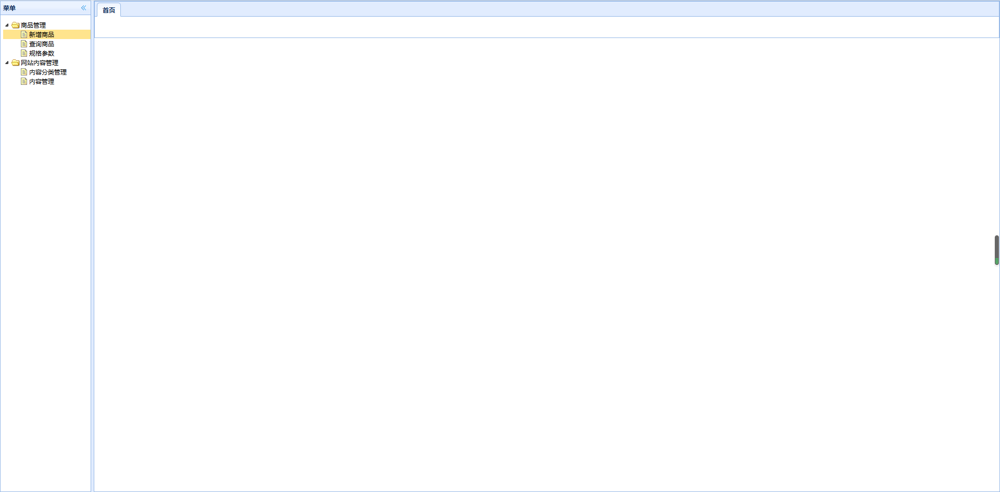
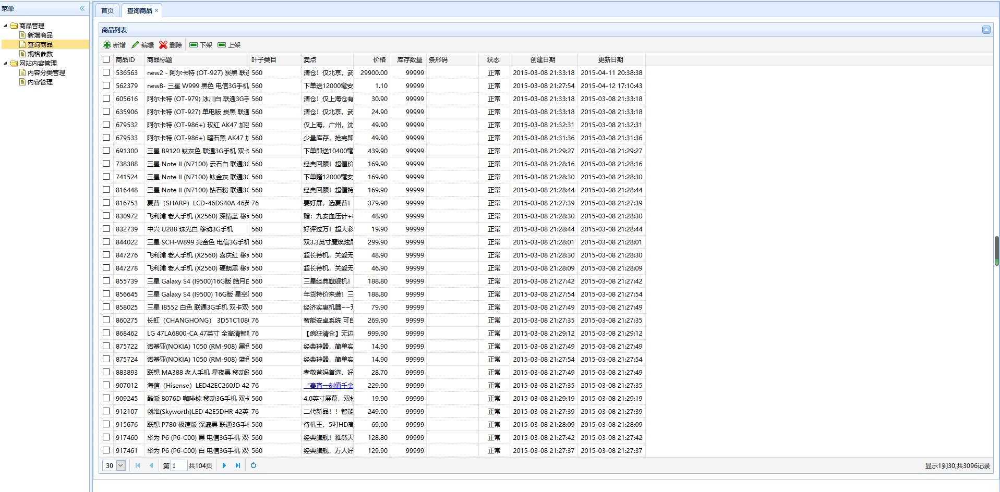

# 2. 查询商品页面显示



效果：



## Spring MVC的url模板映射

```java
    /**
     * 显示商品的查询页面
     * url:/item-list
     * 由于注意到请求的uri和页面名称相同，因此可以使用url模板映射
     */
    @RequestMapping("/{page}")
    public String showPage(@PathVariable("page") String page){
        return page;
    }
```

## mybatis逆向工程

使用mybatis逆向工程生成对应数据表的java bean，dao interface，dao interface mapper文件。

## 配置静态资源映射

第一种方式：

```xml
<!--    配置静态资源映射-->
    <mvc:resources mapping="/js/**" location="/WEB-INF/js/"/>
    <mvc:resources mapping="/css/**" location="/WEB-INF/css/"/>
```

在这里需要注意的是，如果webapp根目录下存在index.jsp，页面，在web项目启动时将不会进入controller方法中；TODO:

第二种方式：

```xml
    <mvc:default-servlet-handler default-servlet-name=""/>
```

参考文章：https://www.cnblogs.com/dflmg/p/6393416.html

## mybatis分页插件PageHelper


---

后台页面使用的是easyui，虽然不会使用，但是根据前端页面的结构可以确定页面要展示出来，所需要数据的获得方法，例如：某个功能调用后端的uri格式；后端需要返回的数据格式；

表现层与service层依赖于共同的规范（taotao-manager-interface模块），在开发时需要转变角色，一方考虑：我要如何实现这个接口，该怎样实现接口所要实现的功能；另一方：注重点在于接口的使用，我要如何使用接口提供的功能实现我的表现层的功能。