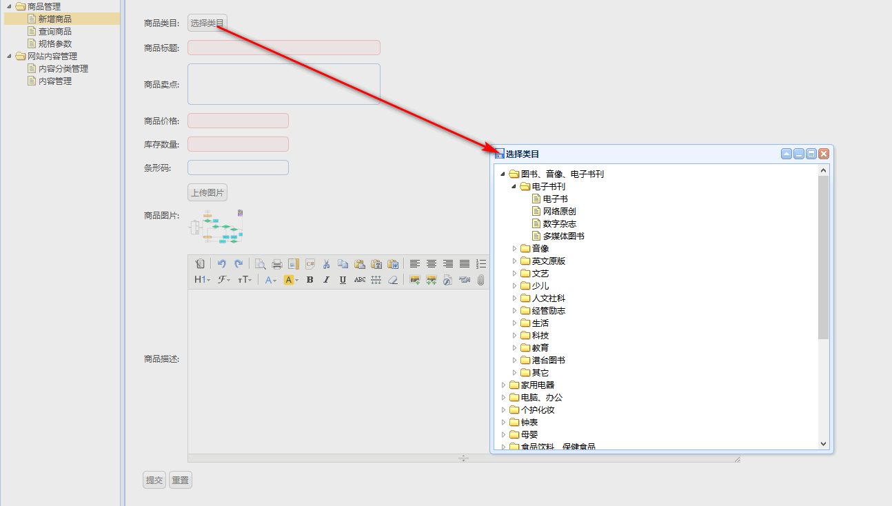
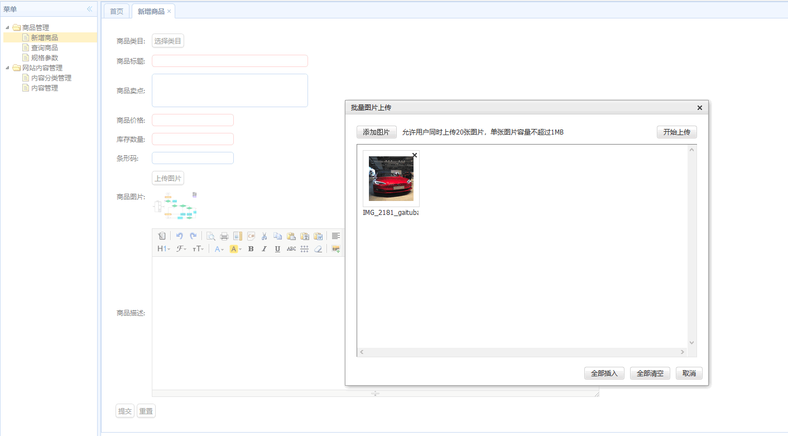
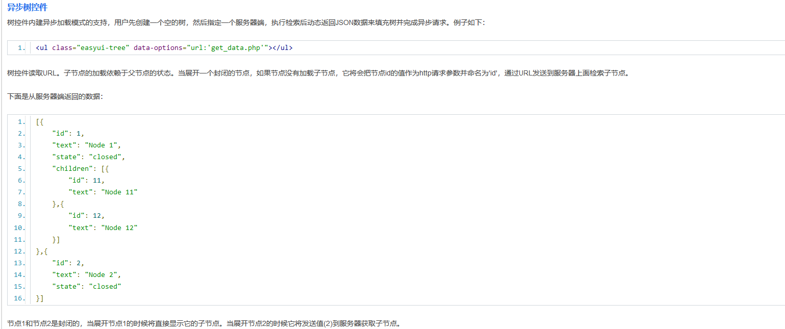
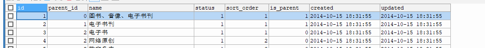

这两天完成了商品类目选择和图片上传的功能，效果图：（由于这部分的两集视频丢失，所以找到了这天的教案，按照教案上面做）





# 3. 商品类目选择和图片上传功能

## 商品类目选择

使用的是easyui的异步树控件：参考：http://www.92ui.net/



```
返回格式为：
[{    
    "id": 1,    
    "text": "Node 1",    
    "state": "closed" // 该节点状态为closed的，当点击该节点时，会把当前节点的id值作为父节点id异步的传递给后台方法，如果是“open”状态，则代表没有子节点；
},{    
    "id": 2,    
    "text": "Node 2",    
    "state": "closed"   
}] 
```

而在数据库表tb_item_cat，中结构与此对应：



## 图片上传功能

单台虚拟机搭建FastDFS环境，用作图片服务器；

1. 下载[fastdfs-client-java](https://github.com/happyfish100/fastdfs-client-java/)，使用maven从源码安装到本地仓库；

```
cd fastdfs-client-java
# 因为我的项目的本地repo是单独的目录，所以可以使用指定--settings位置的方式，安装到指定的本地仓库
mvn install --settings c:\user\settings.xml
```

在taotao-manager-web层，导入maven依赖：

```xml
		<dependency>
			<groupId>org.csource</groupId>
			<artifactId>fastdfs-client-java</artifactId>
			<version>1.27-SNAPSHOT</version>
		</dependency>
```

2. 使用到了spring mvc的文件上传，因此需要添加spring mvc对于文件上传的配置：

```xml
    <!--    添加文件上传的配置-->
    <bean id="multipartResolver" class="org.springframework.web.multipart.commons.CommonsMultipartResolver">
        <property name="defaultEncoding" value="utf-8"/>
        <property name="maxUploadSize" value="5242880"/> <!--最大上传大小为5MB-->
    </bean>
```

3. 406错误

[HTTP 406 错误 – 无法接受 (Not acceptable)](https://www.checkupdown.com/status/E406_zh.html)

```java
    @RequestMapping(value = "/pic/upload", produces = MediaType.TEXT_PLAIN_VALUE+";charset=utf-8")
    @ResponseBody
    public String fileUpload(MultipartFile uploadFile) {
```

使用produces的原因是：*KindEditor的图片上传插件，对浏览器兼容性不好，不能使用JSON响应*；*返回字符串时的Content-Type为：text/plain;charset=UTF-8   它是可以成功返回的*。

## 问题

### 1. 

在fastdfs的使用上，遇到了一点问题：

在使用：

```java
ClientGlobal.init("classpath:resource/client.conf"); // 错误写法
```

加载配置文件时，会抛出‘在配置文件resource/client.conf中找不到tracker_server’的错误；按照在spring中使用的方式，真是不得解；后来试着去看init方法的实现：

```java
# 结合官方网的描述：优先按OS文件系统路径读取，没有找到才查找项目classpath
	public static InputStream loadFromOsFileSystemOrClasspathAsStream(String filePath) {
        Object in = null;

        try {
            if ((new File(filePath)).exists()) {
                in = new FileInputStream(filePath);
            } else {
                in = classLoader().getResourceAsStream(filePath);
            }
        } catch (Exception var3) {
            var3.printStackTrace();
        }

        return (InputStream)in;
    }
    
    public static ClassLoader classLoader() {
        ClassLoader loader = Thread.currentThread().getContextClassLoader(); // 获得类加载器
        if (loader == null) {
            loader = ClassLoader.getSystemClassLoader();
        }

        return loader;
    }
```

因此在指定文件路径时，不需要使用`classpath:`。

### 2. mybatis的@Param注解

[关于mybatis中基本类型条件判断问题](https://www.cnblogs.com/duanxz/p/5045919.html)mybatis的@Param注解。

当使用mybatis的动态语句的特性取值时，比如下面的这种用法：

```xml
<if test="parentId!=null">
    
</if>

接口声明为：
List<TbItemCat> selectById(long parentId);
```

此时，在执行查询时会抛出：`There is no getter for property named 'parentId' in 'class java.lang.Long`  。从这里可以了解到：

1. test中的判断的属性是通过getter方法从对象中获取的；
2. 这里的错误将parentId当做了Long的一个成员属性；而这不是我们想要的；

解决方式是*使用mybatis的@Param注解*；

---

自己做下笔记：

1. fastdfs安装在了`/etc/fdfs/`下，

   ```
   启动fastdfs storage：
   fdfs_storaged /etc/fdfs/storage.conf restart
   启动fastdfs tracker：
   fdfs_trackerd /etc/fdfs/tracker.conf restart
   查看启动情况：
   $ ps -ef |grep fdfs
   root      10065      1  2 21:48 ?        00:00:00 fdfs_storaged /etc/fdfs/storage.conf restart
   root      10082      1  0 21:48 ?        00:00:00 fdfs_trackerd /etc/fdfs/tracker.conf restart
   root      10090   9617  0 21:48 pts/4    00:00:00 grep --color=auto fdfs
   ```

   启动nginx：

   ```
   nginx安装目录：/usr/local/nginx
   启动：./sbin/nginx
   ```

   