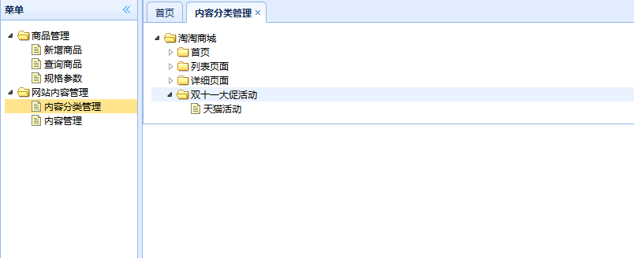

界面效果：

# 内容分类界面显示和内容分类（添加功能）

网站的内容管理，负责门户系统的内容展示；上面的网站内容管理部分相当于一个简易版的CMS系统。

> 内容管理系统（content management system，CMS）是一种位于WEB 前端（Web 
> 服务器）和后端办公系统或流程（内容创作、编辑）之间的软件系统。内容的创作人员、编辑人员、发布人员使用内容管理系统来提交、修改、审批、发布内容。这里指的“内容”可能包括文件、表格、图片、数据库中的数据甚至视频等一切你想要发布到Internet、Intranet以及Extranet网站的信息。

**网站内容管理**部分由`taotao-content`管理，并使用dubbo发布服务；组织结构类似于商品管理。

到现在为止，taotao商城项目主要分为了四部分：

1. 门户系统`taotao-portal-web`；
2. CMS系统`taotao-content`；
3. 后台管理系统（显示界面部分）`taotao-manager-web`；
4. 后台管理系统（后端部分）`taotao-manager`；