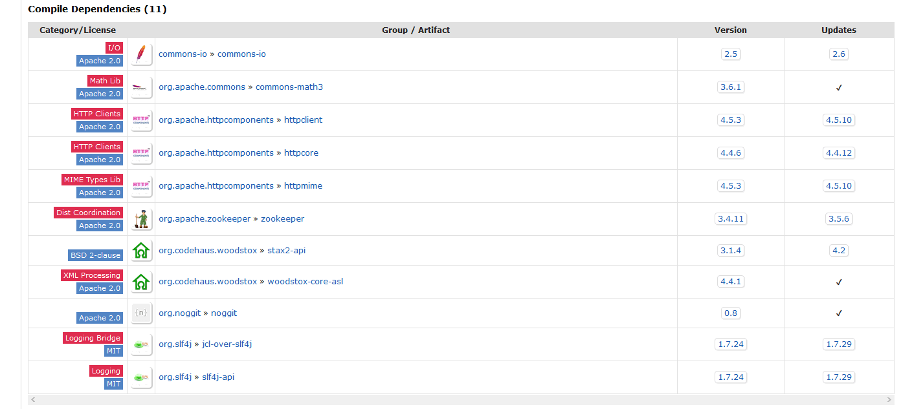

项目模块的划分及主要功能：

1. taotao-manager

   负责为后台管理界面提供服务，使用fastdfs来保存上传的图片。

2. taotao-manager-web

   后台管理界面，使用easyui做页面展示，使用kindeditor进行图片文件的上传。

3. taotao-content

   提供后台管理界面的内容管理部分的功能；管理门户首页的不同区域的展示内容(CMS)。

   使用redis做缓存，缓存首页需要展示的数据。

4. taotao-search

   使用solr提供站内搜索功能。

5. taotao-search-web

   搜索结果页面，提供搜索结果的展示。

6. taotao-portal-web

   门户网站的首页。

使用到的技术：SSM，dubbo，solr，redis，zookeeper。

小记：

- 开发商城项目，用到传值的时候，要记得考虑`post`/`get`方法传值时的乱码问题；

- 使用maven时，遇到包冲突的问题，可以查看mvnrepository的`Compile Dependencies`，来确定依赖的版本号，或者排除依赖：(以solrj的httpclient依赖为例)

  

- 项目中引入redis做缓存时，要本着**缓存的执行不能影响正常业务**的原则；
- 请求转发与响应重定向路径的填写：https://blog.csdn.net/I_itaiit/article/details/103020793

- 在spring mvc中配置了

  ```
  <url-pattern>/</url-pattern>
  ```

  时，这种配置会拦截静态资源文件的访问，要添加`<mvc:resources/>`配置。

  `/`这种形式的映射，会拦截所有的路径请求，也包括了对静态资源的访问（*.jsp除外）；我们在web.xml中写了这种形式的映射之后，实际上是覆盖掉了容器默认的名为`default`的servlet的映射方式。

  `/*`这种形式的映射本身就是错误的映射方式，会导致转发到jsp页面时，也会由DispatcherServlet解析。

  参考：https://blog.csdn.net/qq_35993946/article/details/88059121